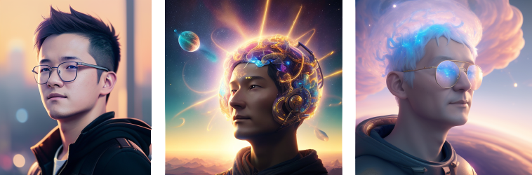

# Dream Ops

- [Dream Ops](#dream-ops)
  - [Quick Start](#quick-start)
  - [Configurations](#configurations)
  - [References](#references)

`dream-ops` is a containerized photo pipeline to customize Stable Difussion Models. It automatically crops faces in the photos. 

`dream-ops` requires a NVIDIA GPU to run, tested on RTX A5000.

Great thanks to my friend [Xinyuan](https://www.linkedin.com/in/xinyuanliu/) for allowing me to use his photos, you look stunning!




## Quick Start

After cloning the repo, you can run the following commands in `./` directory:

1. Build the image and get inside the container:
   - Note: you can mount Stable Diffusion Models to `/dreambooth/models` in the container, eg. `-v "$(dirname "$(pwd)")/models:/models" \`, and the checkpoints will be moved there after training is successful.

    ```bash
    # build image
    docker build -t dream-ops:cu11.8 .

    # get inside the container.
    docker run --rm -it \
        --hostname `hostname` \
        --gpus all --ipc=host \
        -v .:/dreambooth \
        dream-ops:cu11.8 bash
    ```
2. Start pipeline: `python3 pipeline.py` and follow the instructions to put your images in the right place.

## Configurations

In `./config.yml`, todo.

## References

1. https://github.com/ShivamShrirao/diffusers/tree/main/examples/dreambooth
2. https://colab.research.google.com/github/sagiodev/stablediffusion_webui/blob/master/DreamBooth_Stable_Diffusion_SDA.ipynb#scrollTo=K6xoHWSsbcS3